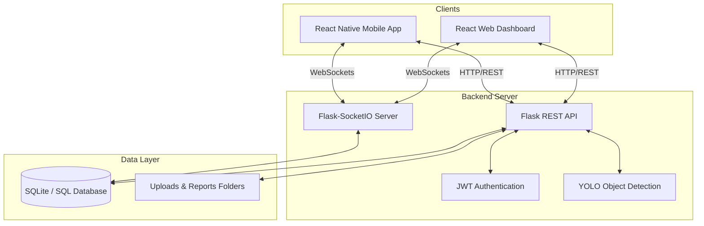

# YantraGuard

YantraGuard is an intelligent surveillance and incident management system. It leverages computer vision (YOLO) to detect incidents in real-time and provides a comprehensive suite of applications including a Python-based backend, a React web dashboard, and a React Native mobile application for on-the-go monitoring.

## Features

* Real-time Object/Incident Detection using Ultralytics YOLO
* Live Alerts and Notifications via WebSockets (Socket.IO)
* Secure Authentication with JWT (JSON Web Tokens)
* Web Dashboard for administrators and managers
* Cross-platform Mobile Application for remote monitoring
* Automated Email Notifications and Reporting (PDF generation)

## System Architecture



## Technology Stack

### Backend
* Framework: Flask
* Database: SQLite (via SQLAlchemy)
* Migrations: Flask-Migrate
* Authentication: Flask-JWT-Extended
* Real-time: Flask-SocketIO
* Machine Learning: Ultralytics YOLO
* Others: Flask-Mail, ReportLab (PDF)

### Frontend (Web)
* Framework: React 19 (via Vite)
* Styling: Tailwind CSS
* Routing: React Router v7
* Real-time: Socket.IO Client

### Mobile Application
* Framework: React Native (Expo)
* Navigation: Expo Router / React Navigation
* Real-time: Socket.IO Client

## Installation and Setup

### Prerequisites
* Python 3.9+
* Node.js 18+
* Expo CLI (for mobile app)

### 1. Backend Setup

Navigate to the backend directory and set up the Python environment:

```bash
cd backend
python -m venv venv

# On Windows
venv\Scripts\activate
# On macOS/Linux
source venv/bin/activate

pip install -r requirements.txt
```

Create a `.env` file in the `backend` directory with the following configuration:
```env
JWT_SECRET_KEY=your_secure_jwt_key
MAIL_SERVER=smtp.example.com
MAIL_PORT=587
MAIL_USERNAME=your_email@example.com
MAIL_PASSWORD=your_email_password
MAIL_DEFAULT_SENDER=your_email@example.com
MANAGER_EMAIL=manager@example.com
YOLO_MODEL_PATH=path/to/your/model.pt
```

Initialize and run the database migrations:
```bash
flask db upgrade
```

Start the Flask server:
```bash
python app.py
```

### 2. Frontend Web Setup

Navigate to the frontend directory:
```bash
cd frontend_web
npm install
```

Start the Vite development server:
```bash
npm run dev
```

### 3. Mobile App Setup

Navigate to the mobile app directory:
```bash
cd mobile_app
npm install
```

Start the Expo development server:
```bash
npm start
```
Use the Expo Go app on your physical device or run an Android/iOS emulator to view the application.

## Directory Structure

```text
YantraGuard/
|-- backend/           # Flask backend API and ML models
|-- frontend_web/      # React + Vite web dashboard
|-- mobile_app/        # React Native (Expo) mobile application
|-- .gitignore         # Git ignore rules
|-- README.md          # Project documentation
```

## Security Notice

Never commit your `.env` files or the `__pycache__` directories to version control. Ensure they remain listed in the `.gitignore` file to protect your sensitive credentials.
